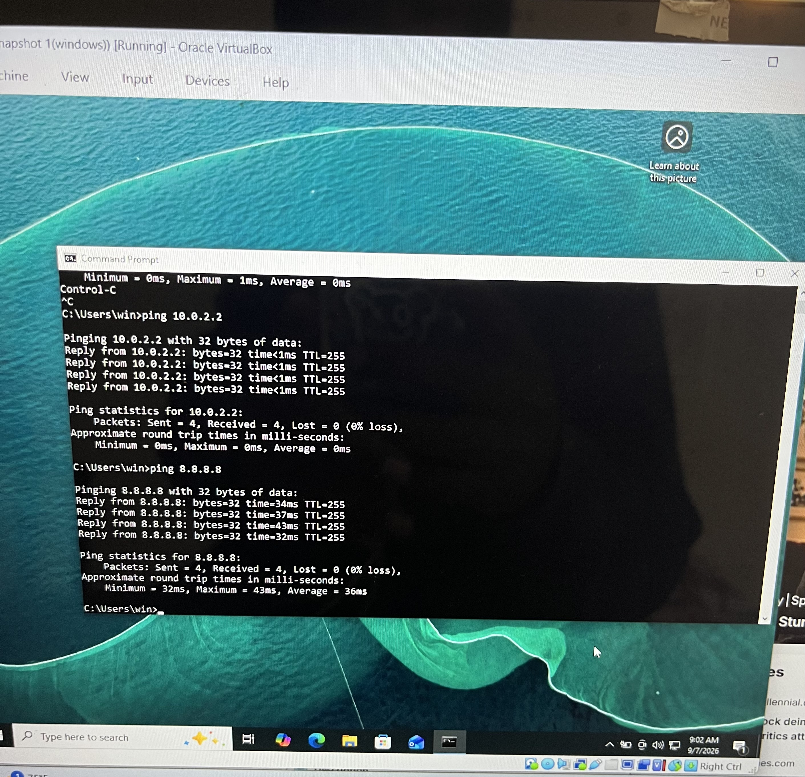
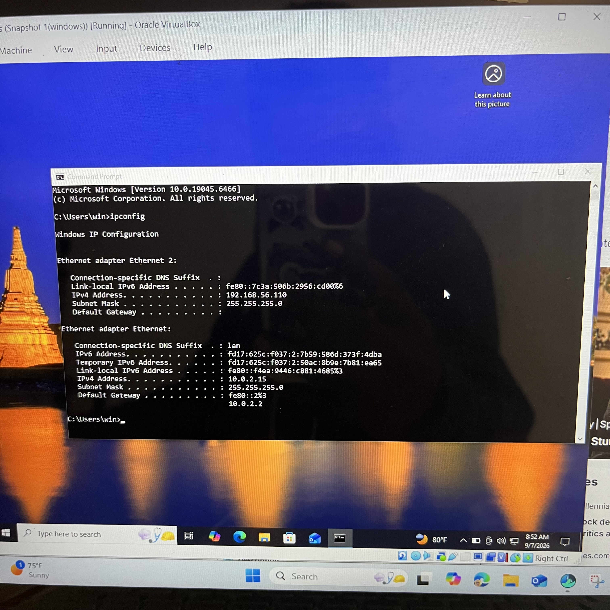
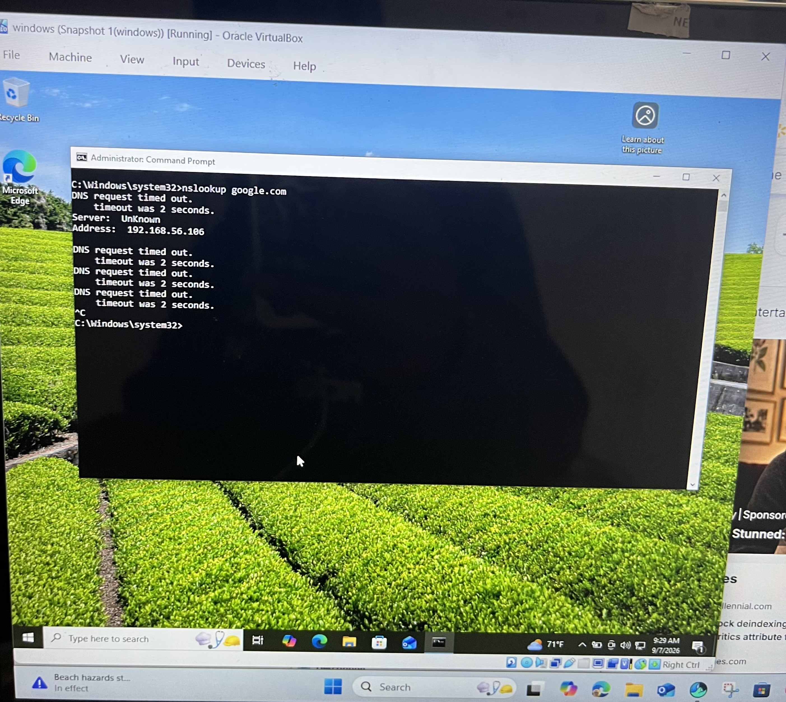
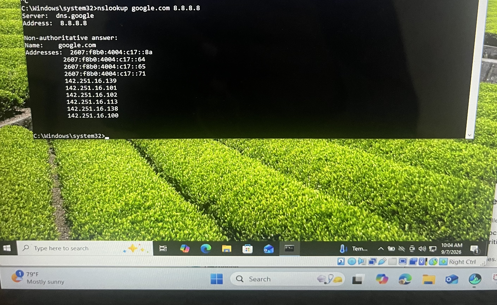
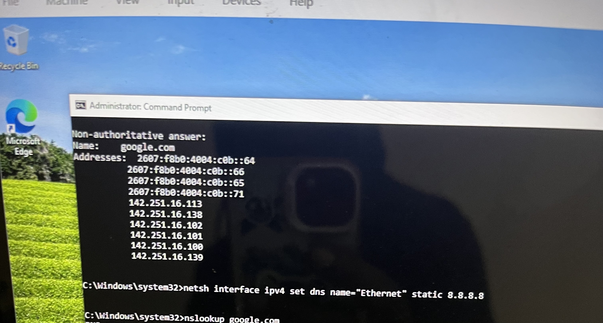

# Ticket 04: Windows DNS Troubleshooting & Network Configuration

## Overview

Simulated a Help Desk ticket involving a Windows workstation that had Internet connectivity but was unable to resolve websites by hostname. Used a structured troubleshooting process to identify the DNS problem, test a known-good DNS server, correct the DNS configuration, and verify the fix.

## Lab Environment

* **Client:** Windows Workstation
* **Virtualization:** VirtualBox
* **Host-only IP:** 192.168.56.110
* **NAT IP:** 10.0.2.15
* **Default Gateway:** 10.0.2.2
* **DNS Servers Tested:** Google Public DNS — 8.8.8.8; Cloudflare DNS — 1.1.1.1

## Help Desk Troubleshooting

### 1. Verify Network Connectivity

Started by testing the default gateway to confirm the workstation had local network connectivity.



The gateway responded successfully.

Internet connectivity was then tested using Google's public IP address. The test was successful, confirming that Internet connectivity was available.

### 2. Review Network Configuration

Used `ipconfig` to review the workstation's network adapters, IP addresses, and default gateway.



The workstation had separate Host-only and NAT network connections.

### 3. Test DNS Resolution

Tested hostname resolution with:

```text
nslookup google.com
```

The request timed out and selected `192.168.56.106` as the DNS server.



This showed that the workstation had network connectivity, but normal DNS resolution was failing.

### 4. Test a Known-Good DNS Server

Queried Google Public DNS directly:

```text
nslookup google.com 8.8.8.8
```



The query successfully returned Google's addresses.

This confirmed that external DNS resolution was working and helped isolate the problem to the workstation's DNS configuration.

### 5. Correct the DNS Configuration

Configured the workstation to use Google Public DNS (`8.8.8.8`) for DNS resolution.



The goal was to correct the DNS configuration without changing the workstation's IP addressing or network connectivity.

### 6. Verify the Resolution

Ran the original DNS test again and verified that hostname resolution was restored.

![Successful DNS Resolution]


The workstation successfully resolved `google.com`.

Finally, `ping google.com` was used to verify hostname resolution and connectivity. The test completed successfully with 0% packet loss.

## Troubleshooting Outcome

The issue was isolated to DNS resolution rather than general network connectivity. After correcting the DNS configuration, hostname resolution was restored and verified using `nslookup` and `ping`.

## Help Desk Skills Demonstrated

* Network connectivity troubleshooting
* DNS troubleshooting
* `ipconfig` and `nslookup` usage
* Testing a known-good DNS server
* Identifying DNS configuration issues
* Verifying corrective actions
* Structured troubleshooting methodology
* Technical documentation
* Evidence-based troubleshooting


